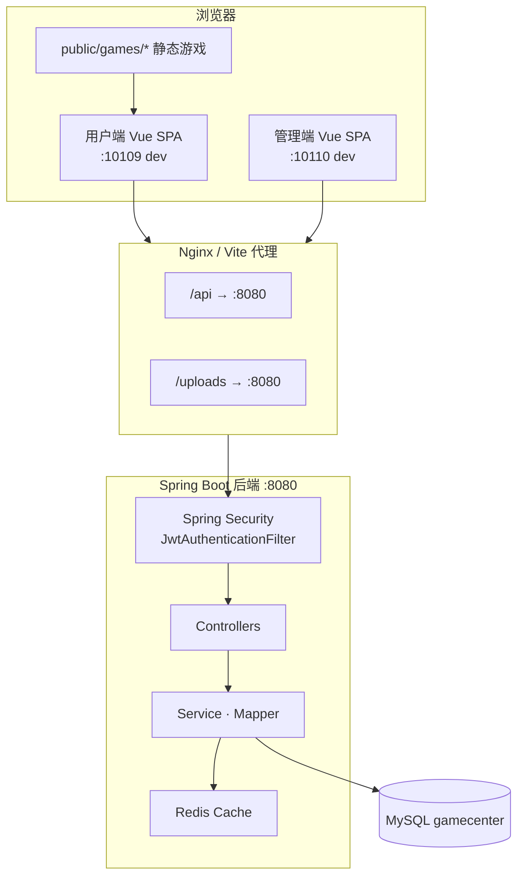
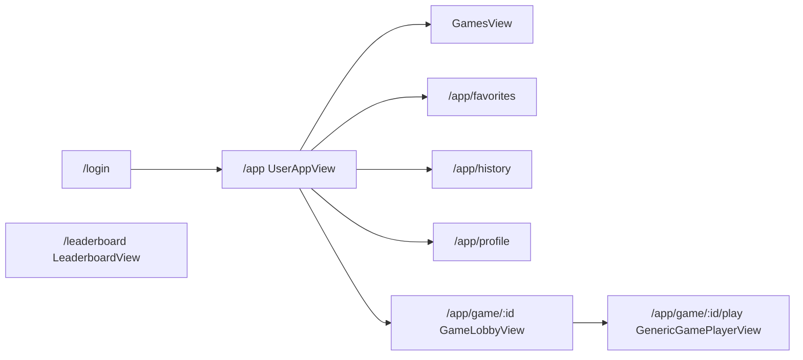
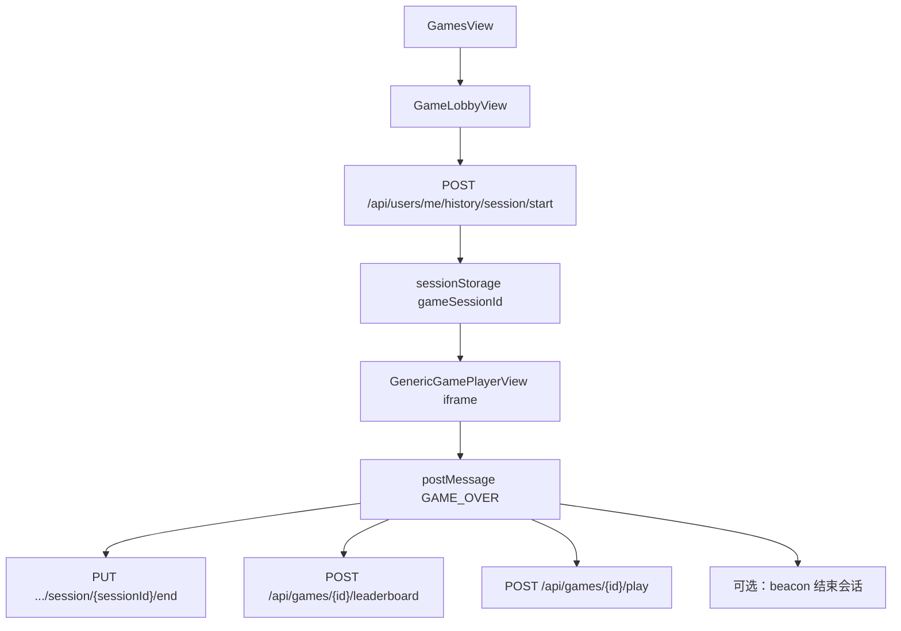
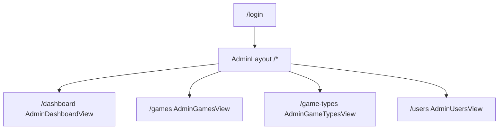
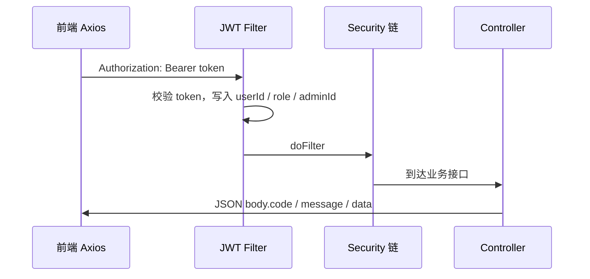
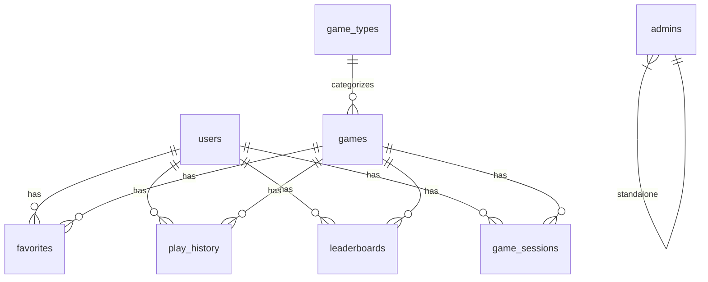
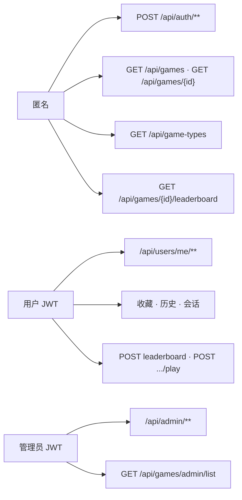

# GameCenter 项目文档

> **仓库根目录**：`d:\SystemDemo\GameCenter`  
> **最后更新**：2026-05-30  
> 本文档为 GameCenter 的**唯一权威项目文档**，涵盖架构、规范、API、部署与运维。

---

## 目录

- [1. 项目介绍](#1-项目介绍)
- [2. 技术架构](#2-技术架构)
- [3. 开发规范](#3-开发规范)
- [4. 项目结构](#4-项目结构)
- [5. 数据库设计](#5-数据库设计)
- [6. API 规范](#6-api-规范)
- [7. 权限设计](#7-权限设计)
- [8. 部署方案](#8-部署方案)
- [9. 开发流程](#9-开发流程)
- [10. 常见问题](#10-常见问题)

---

## 1. 项目介绍

### 1.1 概述

GameCenter 是一个基于 **Vue 3** 的前端小游戏中心：用户可浏览游戏列表、收藏、查看游玩历史与排行榜，通过 iframe 嵌入静态小游戏（贪吃蛇、俄罗斯方块等）；管理员可在后台管理游戏、类型、用户并查看统计。

后端提供 REST API，负责账户、游戏目录、收藏、游玩历史、游戏会话、排行榜与邮件验证码等能力。

### 1.2 核心功能

| 模块 | 功能 |
|------|------|
| 用户端 | 注册/登录（邮箱验证码）、个人资料与头像、改密、游戏列表与筛选、收藏、游玩历史、游戏会话时长统计、排行榜、iframe 游玩 |
| 管理端 | 管理员登录、游戏/类型 CRUD、用户管理（禁用/重置密码）、统计概览与热门游戏 |
| 基础设施 | JWT 认证、Redis 缓存与验证码、MySQL 持久化、Actuator 健康检查 |

### 1.3 开发进度

| 阶段 | 内容 | 状态 |
|:----:|------|:----:|
| 1 | 用户认证与基础框架 | ✅ |
| 2 | 游戏类型与游戏管理 | ✅ |
| 3 | 收藏功能 | ✅ |
| 4 | 游玩历史与统计 | ✅ |
| 5 | 排行榜 | ✅ |
| 6 | 管理后台（用户/统计） | ✅ |
| — | 邮箱验证码注册/改密 | ✅ |
| — | 用户密码 BCrypt | ✅ |
| — | dev/prod 双 profile | ✅ |

### 1.4 已知缺口（生产注意）

- **管理员密码**：`AdminAuthController` 仍使用**明文**比对 `admins.password_hash`；生产库中管理员密码须存明文，或改代码后迁移为 BCrypt。
- **JWT 登出**：服务端无 Token 黑名单，登出仅前端清除 Token；Token 在过期前仍有效。
- **数据库迁移**：使用 `init_schema.sql` + 手工 `db/migration_*.sql`，尚未接入 Flyway。

---

## 2. 技术架构

### 2.1 技术栈

| 层级 | 技术 |
|------|------|
| 前端 | Vue 3、Vite、TypeScript、Pinia、Vue Router、Axios、Naive UI、Vitest |
| 后端 | Java 17+、Spring Boot 3、Spring Security、MyBatis-Plus、JJWT |
| 数据 | MySQL 8+、Redis（缓存 + 邮箱验证码） |
| 部署 | Nginx（静态 + 反向代理）、Windows 本机或容器化 |

### 2.2 总体架构



### 2.3 配置 Profile

| Profile | 激活方式 | 配置文件 |
|---------|----------|----------|
| **dev**（默认） | 不指定，或 `--spring.profiles.active=dev` | `application.yml` + `application-dev.yml` + 可选 `application-local.yml` |
| **prod** | `--spring.profiles.active=prod` 或 `SPRING_PROFILES_ACTIVE=prod` | 上述 + `application-prod.yml`（DB/JWT/CORS/MAIL 无弱默认） |
| **no-redis** | 与 dev/prod 组合，如 `dev,no-redis` | `application.yml` 内 no-redis 段 |

**dev 默认值**（可被环境变量覆盖）：

| 项 | 默认 |
|----|------|
| MySQL | `localhost:3306/gamecenter`，`root` / `123456` |
| Redis | `localhost:6379` |
| CORS | `http://localhost:10109`, `http://127.0.0.1:10109`, `http://localhost:10110`, `http://127.0.0.1:10110` |
| 后端端口 | `8080` |
| 用户端端口 | `10109` |
| 管理端端口 | `10110` |

### 2.4 用户端页面路由



### 2.5 游戏游玩与数据回写



### 2.6 管理端结构（独立 SPA：`admin-frontend/`，dev 端口 10110）



用户端 `frontend/` 不再提供 `/admin/*` 页面；访问旧路径会重定向到 `http://localhost:10110`。

### 2.7 认证请求序列



### 2.8 已实现的生产能力（代码侧）

- 双 profile：dev 默认；prod 强制环境变量
- JWT 生产校验：弱密钥、空密钥、已知默认值拒绝启动（`JwtUtils#assertProductionSecretStrength`）
- CORS 白名单：`SecurityConfig` 使用 `setAllowedOrigins`
- 用户密码 BCrypt：注册、登录、改密、管理员重置用户密码
- 邮件验证码异步发送：`EmailVerificationServiceImpl` 使用 `CompletableFuture.runAsync`
- Actuator：prod 暴露 `health`、`info`，含 DB/Redis 探测
- 生产错误脱敏；MyBatis SQL 不打印 stdout
- 前端 API 基址：`VITE_API_BASE_URL`（默认 `/api`）

---

## 3. 开发规范

### 3.1 后端规范

- **分层**：`controller` → `service` / `service.impl` → `mapper` → `entity`
- **API 风格**：RESTful；统一响应体 `{ code, message, data }`
- **常量**：路径与错误码集中在 `ApiConstants`、`ApiBizError`
- **密码**：用户侧一律 BCrypt（`PasswordEncoder`）；管理员登录暂为明文（见 §1.4）
- **异常**：`GlobalExceptionHandler` 统一映射；生产不返回堆栈
- **校验**：DTO 使用 Bean Validation；业务错误抛 `BusinessException` + `ApiBizError`
- **缓存**：`@Cacheable` / `@CacheEvict` 用于游戏列表与类型；写操作 evict
- **测试**：`mvn test`；契约测试见 `SecurityConfigContractTest`、`ApiControllerContractTest`

### 3.2 前端规范

- **语言**：TypeScript；组件 `<script setup lang="ts">`
- **UI**：Naive UI；`App.vue` 中 `NConfigProvider` + `darkTheme` + `zhCN`
- **状态**：Pinia `store/auth.ts`；Token / 角色同步 `localStorage`
- **API**：`src/api/index.ts` 封装 Axios；请求头自动附加 `Authorization: Bearer`
- **路由**：`meta.requiresAuth`、`meta.role`（`user` | `admin`）；守卫见 `router/index.ts`
- **错误**：展示文案优先 `response.data.message`；常量见 `constants/apiErrorCodes.ts`
- **游戏页**：不改 iframe、`postMessage` 协议、`sessionStorage` 键名

### 3.3 命名与字段约定

- 数据库：`snake_case`（如 `password_hash`、`created_at`）
- JSON API：`camelCase`（如 `displayName`、`avatarUrl`）
- 接口路径：小写 + 连字符资源名（如 `/api/game-types`）

### 3.4 Git 与敏感文件

以下文件**不得提交**（已在 `.gitignore`）：

- `backend/.env`
- `backend/src/main/resources/application-local.yml`
- `frontend/.env*`、`admin-frontend/.env*`（除 `.env.example`）

模板文件：`backend/env.example`、`frontend/.env.example`、`admin-frontend/.env.example`、`application-local.yml.example`

### 3.5 联调约定

- Controller 正常返回时 HTTP 多为 **200**，成败看 **`body.code`**
- Spring Security 拦截：未登录 **HTTP 401**（`未登录或无权访问`）；权限不足 **HTTP 403**（`无权访问`）
- 前端对任意 **401** 会清空登录态并重定向登录页
- dev 环境前端须走 `:10109`（Vite 代理），勿直接访问 `:8080` 静态页

---

## 4. 项目结构

```
GameCenter/
├── PROJECT.md                 # 本文档（权威）
├── README.md                  # 项目入口（指向 PROJECT.md）
├── init_schema.sql            # 数据库初始化
├── db/
│   ├── migration_leaderboards_unique.sql
│   └── migration_play_history_unique.sql
├── StartGameCenter.cmd        # 开发一键启动（勿用于生产）
├── backend/
│   ├── env.example            # 环境变量模板（DEV / PROD）
│   ├── start-with-redis.ps1   # 开发启动脚本
│   ├── pom.xml
│   └── src/main/
│       ├── java/com/example/gamecenter/
│       │   ├── config/        # SecurityConfig, JwtFilter, CacheConfig...
│       │   ├── controller/    # Auth, User, Game, Admin*...
│       │   ├── service/       # 业务接口与 impl
│       │   ├── mapper/        # MyBatis-Plus Mapper
│       │   ├── entity/        # 实体
│       │   ├── dto/           # 请求/响应 DTO
│       │   ├── constant/      # ApiConstants, ApiBizError
│       │   └── utils/         # JwtUtils, AvatarUrlUtils
│       └── resources/
│           ├── application.yml
│           ├── application-dev.yml
│           ├── application-prod.yml
│           └── application-local.yml.example
├── frontend/                  # 用户端 SPA（dev :10109，build → dist/）
│   ├── package.json           # npm run dev / dev:client
│   ├── vite.config.ts         # dev 端口 10109，代理 /api、/uploads
│   ├── .env.example
│   ├── public/games/          # 内嵌小游戏静态资源
│   └── src/
│       ├── main.ts
│       ├── App.vue
│       ├── api/index.ts       # 用户端 Axios + *Api
│       ├── router/index.ts
│       ├── store/auth.ts
│       ├── views/             # 用户页面组件
│       ├── utils/apiError.ts
│       └── constants/apiErrorCodes.ts
├── admin-frontend/            # 管理端 SPA（dev :10110，build → dist/）
│   ├── package.json           # npm run dev
│   ├── vite.config.ts         # dev 端口 10110，代理 /api、/uploads
│   ├── .env.example
│   └── src/
│       ├── api/index.ts       # 管理端 Axios + admin*Api
│       ├── router/index.ts
│       ├── store/auth.ts
│       ├── layouts/AdminLayout.vue
│       └── views/Admin*.vue
└── uploads/avatars/           # 运行时头像目录（gitignore 或部署时创建）
```

### 4.1 后端 Controller 索引

| Controller | 职责 |
|------------|------|
| `AuthController` | 注册、登录、登出、发送验证码 |
| `UserController` | 个人资料、头像、改密 |
| `UserStatsController` | 用户统计与排行榜汇总 |
| `GameController` | 游戏列表/详情、游玩统计、管理端列表 |
| `GameTypeController` | 游戏类型公开列表 |
| `FavoriteController` | 收藏 CRUD、批量检查 |
| `PlayHistoryController` | 游玩历史 |
| `GameSessionController` | 游戏会话 start/end/beacon |
| `LeaderboardController` | 排行榜查询与提交 |
| `AdminAuthController` | 管理员登录/登出 |
| `AdminGameController` | 游戏 CRUD |
| `AdminGameTypeController` | 类型 CRUD |
| `AdminUserController` | 用户管理 |
| `AdminStatisticsController` | 统计概览、热门游戏 |

### 4.2 前端视图索引

**用户端 `frontend/`**

| 视图 | 路径 |
|------|------|
| `LoginView` / `RegisterView` | `/login`, `/register` |
| `UserAppView` + 子路由 | `/app/*` |
| `LeaderboardView` | `/leaderboard` |

**管理端 `admin-frontend/`**（http://localhost:10110）

| 视图 | 路径 |
|------|------|
| `AdminLoginView` | `/login` |
| `AdminLayout` + 子路由 | `/dashboard`, `/games`, `/game-types`, `/users` |

---

## 5. 数据库设计

### 5.1 初始化

```powershell
cd d:\SystemDemo\GameCenter
mysql -u root -p gamecenter < init_schema.sql
```

旧库升级按需执行 `db/migration_*.sql`。全新安装时末尾 `ALTER TABLE games ADD COLUMN controls` 若报 Duplicate column 可忽略。

### 5.2 ER 关系概览



### 5.3 表结构

#### users（用户）

| 字段 | 类型 | 说明 |
|------|------|------|
| id | BIGINT PK | 自增 |
| username | VARCHAR(100) UNIQUE | 用户名 |
| password_hash | VARCHAR(255) | BCrypt 哈希 |
| email | VARCHAR(255) UNIQUE | 邮箱 |
| display_name | VARCHAR(100) | 显示名 |
| avatar_url | VARCHAR(255) | 头像 URL |
| status | VARCHAR(32) | `normal` / `disabled` |
| created_at / updated_at | TIMESTAMP | 时间戳 |

#### admins（管理员）

| 字段 | 类型 | 说明 |
|------|------|------|
| id | BIGINT PK | 自增 |
| username | VARCHAR(100) UNIQUE | 用户名 |
| password_hash | VARCHAR(255) | **当前为明文存储** |
| email, display_name | VARCHAR | 联系信息 |
| role | VARCHAR(32) | `admin` / `super_admin` |

#### game_types（游戏类型）

| 字段 | 类型 | 说明 |
|------|------|------|
| id | BIGINT PK | |
| name | VARCHAR(64) | 如：休闲、益智 |
| code | VARCHAR(64) UNIQUE | 如：casual、puzzle |
| description | VARCHAR(255) | 描述 |

#### games（游戏目录）

| 字段 | 类型 | 说明 |
|------|------|------|
| id | BIGINT PK | |
| name | VARCHAR(255) | 游戏名 |
| description | TEXT | 简介 |
| type_id | BIGINT FK | 关联 game_types |
| resource_url | VARCHAR(1024) | 如 `/games/snake` |
| thumbnail_url | VARCHAR(1024) | 封面 |
| provider, tags | VARCHAR | 来源、标签 |
| controls | TEXT | 操作说明 |
| is_active | TINYINT(1) | 上架状态 |
| play_count | BIGINT | 游玩次数 |
| last_played_at | TIMESTAMP | 最近游玩 |

#### favorites（收藏）

| 字段 | 说明 |
|------|------|
| id, user_id, game_id, created_at | UNIQUE(user_id, game_id) |

#### play_history（游玩历史）

每用户每游戏**至多一行**；重复游玩时应用层 upsert 累加时长、覆盖分数。

| 字段 | 说明 |
|------|------|
| user_id, game_id | UNIQUE(user_id, game_id) |
| played_at, duration_seconds, score, meta(JSON) | |

#### leaderboards（排行榜）

每游戏每用户每种 type **至多一行**；名次由查询侧 `RANK()` 动态计算。

| 字段 | 说明 |
|------|------|
| game_id, user_id, score | |
| type | `daily` / `weekly` / `all_time`（默认 all_time） |
| period_start, period_end | 可选周期 |
| rank_position | 遗留列，可空置 |

#### game_sessions（游戏会话）

| 字段 | 说明 |
|------|------|
| user_id, game_id | |
| started_at, ended_at | |
| duration_seconds, score, meta | |
| status | `active` / `ended` / `abandoned` |

### 5.4 种子数据

`init_schema.sql` 预置贪吃蛇、俄罗斯方块两条游戏记录（`resource_url` 指向 `/games/snake`、`/games/tetris`）。

---

## 6. API 规范

> **契约原则**：接口路径、方法、参数名与数据结构以本文档为准；实现见 `backend/src/main/java/.../controller/` 与 `frontend/src/api/index.ts`。规范内 **38 个正式接口 + 2 个扩展接口**均已实现。

### 6.1 响应格式

**业务码**：

| code | 含义 |
|------|------|
| 200 | 成功 |
| 400 | 参数错误 |
| 401 | 未授权 |
| 403 | 禁止访问 |
| 404 | 资源不存在 |
| 409 | 冲突（如用户名已存在） |
| 500 | 服务器错误 |

**响应体**：

```json
{
  "code": 200,
  "message": "Success",
  "data": { }
}
```

**HTTP 与 body.code**：

- Controller 正常返回：HTTP 多为 200，成败看 `body.code`
- Security 拦截：HTTP 401/403，body 仍为 `{ code, message, data }`
- 展示文案优先使用 `message`（中文为主）

**业务错误分类**（详见 `ApiBizError`）：

| 分类 | 典型 code | 说明 |
|------|-----------|------|
| 游戏类型 | 400/404/409 | 代码重复、类型不存在、类型下仍有游戏 |
| 游戏 | 400/404 | 必填字段、游戏不存在 |
| 收藏 | 400 | 已收藏、未收藏 |
| 游戏会话 | 400/403/404 | 会话不存在、无权、已结束 |
| 用户/管理用户 | 400/404 | 用户不存在、状态/密码校验 |
| 认证 | 401/409 | 凭据错误、用户名冲突 |
| 用户资料/头像/密码 | 400/500 | 头像文件、原密码错误 |
| Spring Security | 401/403 | 未登录、无权访问 |

### 6.2 接口可见性摘要



### 6.3 认证接口

| # | 方法 | 路径 | 权限 | 说明 |
|---|------|------|------|------|
| 1 | POST | `/api/auth/send-code` | 公开 | 发送邮箱验证码；`purpose`: `register` \| `change_password`；60s 限流 |
| 2 | POST | `/api/auth/register` | 公开 | 注册；需 `verificationCode` |
| 3 | POST | `/api/auth/login` | 公开 | 登录；`username` 可填用户名或邮箱 |
| 4 | POST | `/api/auth/logout` | 用户 | 登出（前端清 Token） |

**注册请求体**：`username`, `password`, `email`, `verificationCode`

**登录响应**：`token`, `user { id, username, email, displayName }`

### 6.4 用户信息接口

| # | 方法 | 路径 | 说明 |
|---|------|------|------|
| 5 | GET | `/api/users/me` | 当前用户信息 |
| 6 | PUT | `/api/users/me` | 更新 `displayName`, `avatarUrl` |
| 6.1 | POST | `/api/users/me/avatar` | multipart 上传头像 |
| 7 | POST | `/api/users/me/password/send-code` | 发送改密验证码 |
| 8 | PUT | `/api/users/me/password` | 改密；`verificationCode` 或 `oldPassword` 二选一 + `newPassword` |
| 9 | GET | `/api/users/me/statistics` | 游玩/收藏/排名汇总 |
| 10 | GET | `/api/users/me/leaderboards` | 各游戏排名汇总 |

**默认头像**：未设置时 API 返回 `/uploads/avatars/3e9ce3813b7199ea9588eeb920f41208_512_512.jpg`（静态资源，不落库）

### 6.5 管理员认证

| # | 方法 | 路径 | 说明 |
|---|------|------|------|
| 11 | POST | `/api/admin/auth/login` | 管理员登录 |
| 12 | POST | `/api/admin/auth/logout` | 管理员登出 |

### 6.6 游戏类型

| # | 方法 | 路径 | 权限 |
|---|------|------|------|
| 13 | GET | `/api/game-types` | 公开 |
| 14 | POST | `/api/admin/game-types` | 管理员 |
| 15 | PUT | `/api/admin/game-types/{id}` | 管理员 |
| 16 | DELETE | `/api/admin/game-types/{id}` | 管理员 |

### 6.7 游戏目录

| # | 方法 | 路径 | 权限 | 说明 |
|---|------|------|------|------|
| 17 | GET | `/api/games` | 公开 | Query: `typeId`, `keyword`, `page`, `pageSize` |
| 17.1 | GET | `/api/games/admin/list` | 管理员 | 含下架游戏 |
| 18 | GET | `/api/games/{id}` | 公开 | 含 `controls` 操作说明 |
| 19 | POST | `/api/admin/games` | 管理员 | |
| 20 | PUT | `/api/admin/games/{id}` | 管理员 | |
| 21 | DELETE | `/api/admin/games/{id}` | 管理员 | |

**列表项字段**：`id`, `name`, `description`, `typeId`, `typeName`, `thumbnailUrl`, `playCount`, `isActive`

### 6.8 收藏

| # | 方法 | 路径 | 说明 |
|---|------|------|------|
| 22 | GET | `/api/users/me/favorites` | 分页收藏列表 |
| 23 | POST | `/api/users/me/favorites` | Body: `{ gameId }` |
| 24 | DELETE | `/api/users/me/favorites/{gameId}` | 取消收藏 |
| 25 | GET | `/api/users/me/favorites/{gameId}/check` | 检查是否收藏 |
| 25.1 | POST | `/api/users/me/favorites/batch-check` | Body: `{ gameIds: [] }` → `{ favoritedGameIds }` |

### 6.9 游玩历史与会话

| # | 方法 | 路径 | 说明 |
|---|------|------|------|
| 26 | GET | `/api/users/me/history` | Query: `gameId`, `page`, `pageSize` |
| 27 | POST | `/api/users/me/history` | 记录/更新历史 |
| 28 | POST | `/api/users/me/history/session/start` | 开始会话 → `sessionId` |
| 29 | PUT | `/api/users/me/history/session/{sessionId}/end` | 结束会话 |
| 30 | GET | `/api/users/me/history/session/current` | 进行中的会话 |
| 30.1 | POST | `/api/users/me/history/session/beacon/end` | Beacon 兜底结束；Body 含 `token`, `sessionId` |

### 6.10 游玩统计

| # | 方法 | 路径 | 说明 |
|---|------|------|------|
| 31 | POST | `/api/games/{id}/play` | 更新 `playCount`, `lastPlayedAt` |

### 6.11 排行榜

| # | 方法 | 路径 | 权限 | 说明 |
|---|------|------|------|------|
| 32 | GET | `/api/games/{id}/leaderboard` | 公开 | Query: `type` (daily/weekly/all_time), `limit` |
| 33 | POST | `/api/games/{id}/leaderboard` | 用户 | Body: `{ score }` → `rankPosition`, `isNewRecord` |
| 34 | GET | `/api/games/{id}/leaderboard/me` | 用户 | 当前用户排名 |

### 6.12 管理员用户管理

| # | 方法 | 路径 | 说明 |
|---|------|------|------|
| 35 | GET | `/api/admin/users` | Query: `keyword`, `status`, `page`, `pageSize` |
| 36 | GET | `/api/admin/users/{id}` | 含 playCount, favoriteCount |
| 37 | PUT | `/api/admin/users/{id}/status` | Body: `{ status: normal\|disabled }` |
| 38 | PUT | `/api/admin/users/{id}/password` | Body: `{ newPassword }`（BCrypt 存储） |

### 6.13 管理员统计

| # | 方法 | 路径 | 说明 |
|---|------|------|------|
| 39 | GET | `/api/admin/statistics/overview` | 用户/游戏/游玩/活跃用户 |
| 40 | GET | `/api/admin/statistics/popular-games` | Query: `limit` |

### 6.14 字段对照（API ↔ 数据库）

| 表 | DB 字段 | API 字段 |
|----|---------|----------|
| users | display_name | displayName |
| users | avatar_url | avatarUrl |
| users | password_hash | （不返回） |
| games | type_id | typeId |
| games | resource_url | resourceUrl |
| games | thumbnail_url | thumbnailUrl |
| games | is_active | isActive |
| games | play_count | playCount |
| games | last_played_at | lastPlayedAt |

完整对照见后端 `ApiConstants` 与各 Entity 注解。

---

## 7. 权限设计

### 7.1 角色模型

| 角色 | JWT claim | 前端 `auth.role` | 说明 |
|------|-----------|------------------|------|
| 普通用户 | `role=user` | `user` | 用户端 `/app/*` |
| 管理员 | `role=admin` | — | 管理端 `admin-frontend`（`:10110`） |

用户与管理员使用**独立登录入口**与 Token；同一浏览器不宜混用两种会话。

### 7.2 Spring Security 规则

`SecurityConfig#filterChain` 公开路径：

| 路径 | 方法 |
|------|------|
| `/actuator/health`, `/actuator/health/**`, `/actuator/info` | * |
| `/api/auth/**`, `/api/admin/auth/login` | * |
| `/api/games` | GET |
| `/api/games/{id}` | GET |
| `/api/game-types` | GET |
| `/uploads/avatars/**` | GET |
| `/api/users/me/history/session/beacon/end` | POST |
| `/**` | OPTIONS |

**其余路径**：`.anyRequest().authenticated()` — 须有效 JWT。

> 注意：管理员专用接口（如 `/api/admin/**`）在 Security 层仅要求「已认证」，**管理员身份**由 Controller 内检查 `request.getAttribute("adminId")` 或 JWT `role=admin` 实现。

### 7.3 JWT 生命周期

- 默认过期：`JWT_EXPIRATION_MS=86400000`（24h）
- 生成：`JwtUtils#generateToken`（含 userId, username, role）
- 校验：`JwtAuthenticationFilter#doFilterInternal`
- 登出：无服务端黑名单；Token 过期前仍有效
- prod 密钥：`JWT_SECRET_KEY` 须 `openssl rand -base64 48` 生成，弱密钥拒绝启动

### 7.4 前端路由守卫

**用户端** `frontend/src/router/index.ts`：`requiresAuth` → `/login`；`/admin/*` 重定向至管理端 URL。

**管理端** `admin-frontend/src/router/index.ts`：未登录访问受保护路由 → `/login`。

### 7.5 CORS

- 配置项：`app.cors.allowed-origins`（列表）
- dev 默认：`http://localhost:10109`, `http://127.0.0.1:10109`, `http://localhost:10110`, `http://127.0.0.1:10110`
- prod：通过 `APP_CORS_ALLOWED_ORIGINS` 注入，须与浏览器 Origin **完全一致**（含协议，无尾斜杠）
- `allowCredentials(true)` 时禁止使用 `*`

### 7.6 密码策略

| 对象 | 存储 | 校验 |
|------|------|------|
| users | BCrypt | `PasswordEncoder.matches()` |
| admins | **明文**（当前） | `password.equals(admin.getPasswordHash())` |

管理员重置用户密码时自动 BCrypt 编码。

---

## 8. 部署方案

### 8.1 架构概览

- **前端**：`frontend/dist` 由 Nginx/CDN 托管；SPA `try_files` 回落 `index.html`
- **后端**：`java -jar gamecenter-backend-*.jar --spring.profiles.active=prod`
- **依赖**：MySQL 8+、Redis；网关 `/api` 反代 Spring Boot；`/uploads` 可 Nginx 直出或反代
- **开发脚本**：`StartGameCenter.cmd`、`start-with-redis.ps1` **仅用于本地开发**

### 8.2 生产 MySQL

```sql
CREATE USER IF NOT EXISTS 'gamecenter'@'localhost' IDENTIFIED BY '<强密码_至少16位>';
CREATE DATABASE IF NOT EXISTS gamecenter CHARACTER SET utf8mb4 COLLATE utf8mb4_unicode_ci;
GRANT SELECT, INSERT, UPDATE, DELETE, CREATE, ALTER, INDEX, DROP, REFERENCES
  ON gamecenter.* TO 'gamecenter'@'localhost';
FLUSH PRIVILEGES;
```

```powershell
mysql -u gamecenter -p gamecenter < init_schema.sql
```

**初始管理员**（密码存明文，见 §7.6）：

```sql
INSERT INTO admins (username, password_hash, email, display_name, role)
VALUES ('admin', '<强密码_明文>', 'admin@example.com', '管理员', 'admin');
```

**网络安全**：MySQL 3306 不对公网开放；同机部署时 `bind-address = 127.0.0.1`。

### 8.3 生产 Redis

```powershell
cd D:\Redis
.\redis-server.exe --service-install --service-name RedisGameCenter
Start-Service RedisGameCenter
.\redis-cli.exe ping   # PONG
```

可选 `requirepass` → 同步 `SPRING_DATA_REDIS_PASSWORD`；6379 不对公网开放。

### 8.4 环境变量

复制 `backend/env.example` 为 `backend/.env`（勿提交 Git）。

**prod 必填**：

| 变量 | 说明 |
|------|------|
| `SPRING_PROFILES_ACTIVE` | `prod` |
| `SPRING_DATASOURCE_URL` / `USERNAME` / `PASSWORD` | 生产 MySQL |
| `SPRING_DATA_REDIS_HOST` | Redis 主机 |
| `JWT_SECRET_KEY` | `openssl rand -base64 48` |
| `APP_CORS_ALLOWED_ORIGINS` | 前端 Origin，逗号分隔 |
| `MAIL_HOST` / `MAIL_USERNAME` / `MAIL_PASSWORD` | SMTP |
| `MAIL_FROM` | 可选发件人显示名 |

**加载 .env**（Spring Boot 不会自动读取）：

```powershell
cd d:\SystemDemo\GameCenter\backend
Get-Content .env | ForEach-Object {
    if ($_ -match '^\s*#' -or $_ -match '^\s*$') { return }
    $name, $value = $_ -split '=', 2
    [System.Environment]::SetEnvironmentVariable($name.Trim(), $value.Trim(), 'Process')
}
```

长期运行请用 NSSM / Windows 服务 / 任务计划配置环境块。

**前端构建**：

```powershell
cd frontend
Copy-Item .env.example .env.production
# 默认同源：VITE_API_BASE_URL=/api
npm ci && npm run build
```

### 8.5 构建与启动

```powershell
# 后端
cd backend
mvn -DskipTests package
# 产物：target\gamecenter-backend-0.0.1-SNAPSHOT.jar

# 启动
java -jar .\target\gamecenter-backend-0.0.1-SNAPSHOT.jar --spring.profiles.active=prod
```

**NSSM 示例**：Path=`java.exe`；Arguments=`-jar d:\SystemDemo\GameCenter\backend\target\gamecenter-backend-0.0.1-SNAPSHOT.jar --spring.profiles.active=prod`；Environment 粘贴 `.env` 全部键值。

### 8.6 Nginx 配置要点

```nginx
server {
    listen       80;
    server_name  game.yourdomain.com;
    root   C:/nginx/html/gamecenter;
    index  index.html;

    location / {
        try_files $uri $uri/ /index.html;
    }
    location /api/ {
        proxy_pass         http://127.0.0.1:8080/api/;
        proxy_http_version 1.1;
        proxy_set_header   Host              $host;
        proxy_set_header   X-Real-IP         $remote_addr;
        proxy_set_header   X-Forwarded-For   $proxy_add_x_forwarded_for;
        proxy_set_header   X-Forwarded-Proto $scheme;
        proxy_read_timeout 120s;
    }
    location /uploads/ {
        proxy_pass         http://127.0.0.1:8080/uploads/;
        proxy_set_header   Host $host;
    }
}
```

HTTPS：自签或 Let's Encrypt（win-acme）；更新 `APP_CORS_ALLOWED_ORIGINS` 为 `https://...` 并重启后端。

### 8.7 SMTP（QQ 邮箱示例）

```
MAIL_HOST=smtp.qq.com
MAIL_PORT=465
MAIL_USERNAME=你的QQ@qq.com
MAIL_PASSWORD=<SMTP授权码>
MAIL_FROM=GameCenter <你的QQ@qq.com>
```

在 QQ 邮箱设置中开启 IMAP/SMTP 并生成**授权码**（非 QQ 登录密码）。

### 8.8 健康检查与冒烟

```powershell
Invoke-RestMethod http://127.0.0.1:8080/actuator/health
Invoke-RestMethod http://127.0.0.1:8080/actuator/info
```

| 检查项 | 通过标准 |
|--------|----------|
| status | UP |
| db / redis | UP |

业务冒烟：首页游戏列表 → 注册/登录 → 邮件验证码 → 管理后台登录。

### 8.9 发布日验收清单

- [ ] MySQL / Redis 服务运行
- [ ] `backend/.env` 必填项已填（JWT、CORS、MAIL）
- [ ] 后端 `prod` 启动无异常
- [ ] `/actuator/health` → UP
- [ ] 前端 `dist` 已部署，Nginx SPA 正常
- [ ] `/api/game-types` 经网关可访问
- [ ] 注册/登录/邮件冒烟通过
- [ ] MySQL/Redis 未对公网开放
- [ ] `application-local.yml`、`.env` 未提交 Git
- [ ] 存量 users 密码已 BCrypt（或已重置）
- [ ] CORS 与前端正式域名一致
- [ ] HTTPS 全站（生产）

### 8.10 生产就绪后续项（P1/P2）

| 主题 | 建议 |
|------|------|
| Flyway | 替代手工 `db/migration_*.sql` |
| JWT 黑名单 / Refresh | Redis 存 jti 或短 access + refresh |
| 管理员 BCrypt | 改 `AdminAuthController` + 迁移 admins |
| 接口限流 | Nginx `limit_req`、登录失败计数 |
| 对象存储 CDN | 头像 OSS + CDN |
| Prometheus | `/actuator/prometheus`（内网 + 认证） |

---

## 9. 开发流程

### 9.1 环境要求

| 组件 | 版本 |
|------|------|
| Java | 17+ |
| Maven | 3.8+ |
| Node.js | 18+ LTS |
| MySQL | 8+ |
| Redis | Windows 版或 WSL |

### 9.2 首次搭建

**1. MySQL**

```powershell
mysql -u root -p -e "CREATE DATABASE IF NOT EXISTS gamecenter CHARACTER SET utf8mb4 COLLATE utf8mb4_unicode_ci;"
cd d:\SystemDemo\GameCenter
mysql -u root -p gamecenter < init_schema.sql
```

**2. Redis**

解压至 `D:\Redis`（或设置 `GAMECENTER_REDIS_HOME` / `app.redis.local-home`）：

```powershell
cd D:\Redis
.\redis-server.exe
.\redis-cli.exe ping   # PONG
```

**3. 本地邮件（可选，注册/改密需要）**

```powershell
cd backend\src\main\resources
Copy-Item application-local.yml.example application-local.yml
# 填入 QQ SMTP 授权码
```

**4. 前端依赖**

```powershell
cd frontend
npm install
```

### 9.3 启动开发环境

**方式 A — 一键（推荐）**

```powershell
d:\SystemDemo\GameCenter\StartGameCenter.cmd
```

调用 `start-with-redis.ps1`：检测/启动 Redis → 前端 `npm run dev` → 后端 `mvn spring-boot:run`（默认 dev profile）。

**方式 B — 分步**

```powershell
# 终端 1：Redis
cd D:\Redis && .\redis-server.exe

# 终端 2：后端
cd d:\SystemDemo\GameCenter\backend
mvn spring-boot:run

# 终端 3：用户端
cd d:\SystemDemo\GameCenter\frontend
npm run dev

# 终端 4（可选）：管理端
cd d:\SystemDemo\GameCenter\admin-frontend
npm run dev
```

**验证**

- 用户端：`http://localhost:10109` — 游戏列表
- 管理端：`http://localhost:10110/login` — 管理员登录
- API：`http://localhost:8080/api/game-types`
- 注册：配置 SMTP 后应收到验证码

### 9.4 常用命令

| 场景 | 命令 |
|------|------|
| 后端测试 | `cd backend && mvn test` |
| 后端打包 | `cd backend && mvn -DskipTests package` |
| 用户端类型检查 | `cd frontend && npm run typecheck` |
| 用户端测试 | `cd frontend && npm test` |
| 用户端构建 | `cd frontend && npm run build` → `frontend/dist/` |
| 管理端类型检查 | `cd admin-frontend && npm run typecheck` |
| 管理端测试 | `cd admin-frontend && npm test` |
| 管理端构建 | `cd admin-frontend && npm run build` → `admin-frontend/dist/` |
| 无 Redis 应急 | `mvn spring-boot:run -Dspring-boot.run.arguments="--spring.profiles.active=no-redis"` |

### 9.5 关键文件路径

| 路径 | 用途 |
|------|------|
| `init_schema.sql` | 数据库初始化 |
| `db/migration_*.sql` | 增量迁移 |
| `backend/env.example` | 后端 env 模板 |
| `backend/.env` | 生产变量（勿提交） |
| `application-dev.yml` / `application-prod.yml` | Profile 配置 |
| `frontend/vite.config.ts` | dev 代理 |
| `frontend/.env.production` | 前端构建变量 |

### 9.6 推荐生产启动顺序

1. MySQL → 2. Redis → 3. 注入环境变量 → 4. `java -jar ... --spring.profiles.active=prod` → 5. Nginx → 6. 健康检查与冒烟

---

## 10. 常见问题

### 10.1 MySQL

| 现象 | 处理 |
|------|------|
| `mysql` 不是命令 | 使用 `"C:\Program Files\MySQL\MySQL Server 8.0\bin\mysql.exe"` |
| 1045 Access denied | 检查 root 密码与 `application-dev.yml` / env |
| 中文乱码 | 确认库为 `utf8mb4` |
| `Public Key Retrieval is not allowed` | JDBC URL 加 `allowPublicKeyRetrieval=true`（dev 默认已含） |
| Duplicate column `controls` | 全新安装可忽略 `init_schema.sql` 末尾 ALTER |

### 10.2 Redis

| 现象 | 处理 |
|------|------|
| `RedisConnectionFailure` | 启动 Redis 或使用 `no-redis` profile（验证码不可用） |
| 连接超时 | 检查 `SPRING_DATA_REDIS_HOST`、防火墙 |

### 10.3 邮件 / SMTP

| 现象 | 处理 |
|------|------|
| 535 认证失败 | 使用 QQ **SMTP 授权码**，非 QQ 登录密码 |
| 发送超时 | 检查网络、端口 465/587、防火墙；dev 可查看后端日志 |
| 60 秒内重复发送 | 同一邮箱同用途 60s 限流，属正常 |

### 10.4 CORS / 前端

| 现象 | 处理 |
|------|------|
| CORS 错误 | 前端须走 `:10109`；prod 时 `APP_CORS_ALLOWED_ORIGINS` 与浏览器 Origin 完全一致 |
| API 404 | 检查 `VITE_API_BASE_URL`；同源部署默认 `/api` |
| SPA 刷新 404 | Nginx 补 `try_files $uri $uri/ /index.html` |

### 10.5 认证 / 密码

| 现象 | 处理 |
|------|------|
| 登录失败（旧库） | 检查 `users.password_hash` 是否为 BCrypt（以 `$2a$`/`$2b$` 开头） |
| 存量明文用户密码 | 见下方 BCrypt 迁移 |
| 管理员登录失败 | 当前 admins 表须存**明文**密码 |
| JWT 启动失败（prod） | 检查 `JWT_SECRET_KEY` 长度与是否为 dev 默认密钥 |

**存量 users BCrypt 迁移**：

```sql
SELECT id, username, LEFT(password_hash, 7) AS prefix
FROM users
WHERE password_hash NOT LIKE '$2a$%' AND password_hash NOT LIKE '$2b$%' AND password_hash NOT LIKE '$2y$%';
```

无结果则无需迁移。否则：管理员重置密码、用户自助改密、或测试库手动 BCrypt 后 UPDATE。

### 10.6 部署

| 现象 | 处理 |
|------|------|
| 502 Bad Gateway | 后端 8080 未启动 |
| `Could not resolve placeholder` | prod 缺少必填 env |
| `.env` 未生效 | Spring Boot 不自动读 `.env`；启动前须手动注入 |
| Actuator DOWN | 检查 MySQL/Redis 连通性 |

### 10.7 开发技巧

- **Pinia 在 Axios 拦截器中使用**：`main.ts` 须先 `app.use(pinia)` 再挂载
- **401 全局行为**：任意 401 清空登录态；联调时注意
- **游戏 iframe**：勿改 `postMessage` 协议与 `sessionStorage` 键名
- **生产脚本**：勿在生产使用 `StartGameCenter.cmd`

---

*文档版本：双 profile（dev 默认 / prod 显式）；Windows + 本机 MySQL + 本机 Redis 部署架构。*
